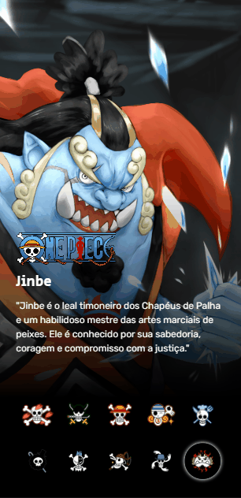

<h1 align="center">Projeto One Piece </h1>  

  <b>Entre no navio dos Chapéus de Palha e explore o incrível universo de One Piece com nossos heróis...

## Índice

- [Introdução](#introdução)
- [Visualização do projeto](#Visualização-do-projeto)
- [Objetivos](#Objetivos)
- [Tecnologias usadas](Tecnologias-usadas)
- [Contato e Feedback](#contato-e-feedback)
- [Agradecimentos](#Agradecimentos)

## Introdução

O projeto é uma página web interativa dedicada ao fascinante mundo dos personagens do anime "One Piece". Aqui, apresentamos uma experiência envolvente que permite aos entusiastas explorar uma coleção de personagens icônicos.

## Visualização do projeto

  
  

[Clique em nosso capitão para ver o projeto em sua própria tela](#Luffy)

## Objetivos

- Desenvolver uma página interativa que apresenta detalhes de personagens em tela cheia.
- Implementar uma funcionalidade interativa que permite a troca entre personagens de uma lista, exibindo informações relevantes para cada um.
- Garantir a responsividade do layout para uma experiência consistente em diferentes tamanhos de tela.

## Tecnologias usadas

- HTML - usada para estruturar a página
- CSS - estilizar elementos da página
- JavaScript - adiciona interações com os elementos

## Contato e Feedback

Adoraríamos ouvir a sua opinião e valorizamos o feedback da comunidade. Estamos comprometidos em melhorar continuamente nosso projeto e sua contribuição é fundamental.

### Fale Conosco

Se você tiver alguma pergunta, sugestão ou apenas desejar entrar em contato, estamos à disposição. Você pode nos encontrar nas seguintes plataformas:

- [LinkedIn](https://www.linkedin.com/in/robson-jorge-62a12a26a/)
- Email: [robsonsouzajorge@hotmail.com](mailto:robsonsouzajorge@hotmail.com)
- WhatsApp: [+55 62 99260-0017]([Whatsapp](https://api.whatsapp.com/send/?phone=%2B556292600017&text&type=phone_number&app_absent=0))

### Sua Opinião Importa

Se você explorou nosso projeto e tem alguma observação, sugestão ou apenas deseja entrar em contato, por favor, compartilhe conosco. Valorizamos seu feedback e estamos constantemente buscando maneiras de melhorar. Seu insight é valioso e ajuda a aprimorar nosso projeto. Não hesite em nos contatar, mesmo que seja apenas para dizer "oi." Aguardamos ansiosamente seu contato e agradecemos sua participação em nossa jornada.

## Agradecimentos

Quero expressar minha sincera gratidão à equipe "Dev em Dobro" pelo evento inspirador. Sua didática e o projeto proposto impulsionaram este projeto, que agora compartilho com vocês. A experiência enriqueceu minha jornada na área de tecnologia. Se você também busca inspiração, confira o canal do YouTube da equipe [Dev em Dobro](https://www.youtube.com/@DevemDobro).
